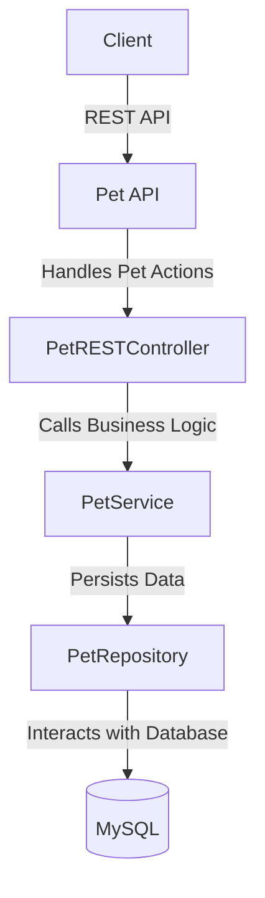

# 🐾 Pet API  

## 🎯 Overview  
Welcome to the **Pet API**, a modern **Spring Boot-based** REST API for managing virtual pets. This API allows users to create, feed, play, and track their pets while ensuring persistent storage using **MySQL**.  

There is also an **Hexagonal Architecture** version of this project taht you can find [here](https://github.com/AlexandraBonetCanela/Pet-api-hexagonal)

## 🚀 Key Features  
✅ **Spring MVC Architecture** – Clean and maintainable design using **Spring Boot**.  
✅ **Pet Management** – Create, update, and delete virtual pets with detailed tracking.  
✅ **User System** – Pets are associated with users, enabling personalized experiences.  
✅ **Persistence with JPA** – Uses **Spring Data JPA** with **MySQL** for robust storage.  
✅ **RESTful API Design** – Fully documented with **OpenAPI (Swagger)** for easy integration.  
✅ **Unit Tested** – Ensures reliability with **JUnit and Mockito**.  

---

### **🛠 Technologies**  
- **Java 21**  
- **Maven 3.6.3**  
- **Spring Boot 3.4.1**  
- **MySQL 9.1.0**  

### **📦 Dependencies**  
- **Spring Web**  
- **Spring Data JPA**  
- **Lombok**  
- **Swagger (Springdoc OpenAPI)**  
- **JUnit 5**  
- **Mockito**  

---

## 📖 **Architecture Overview**  



## To run a project:

Move to the base folder of the project you want to run and:


- Compile the project
```bash
mvn compile
```
- Pack the project
```bash
mvn package
```
- Clean the project
```bash
mvn clean
```
- Execute the application
```bash
mvn spring-boot:run
```
### For API endpoints and usage, refer to the **Swagger UI**:
```sh
http://localhost:8080/swagger-ui.html
```


